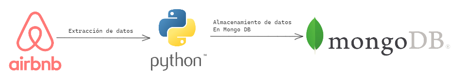
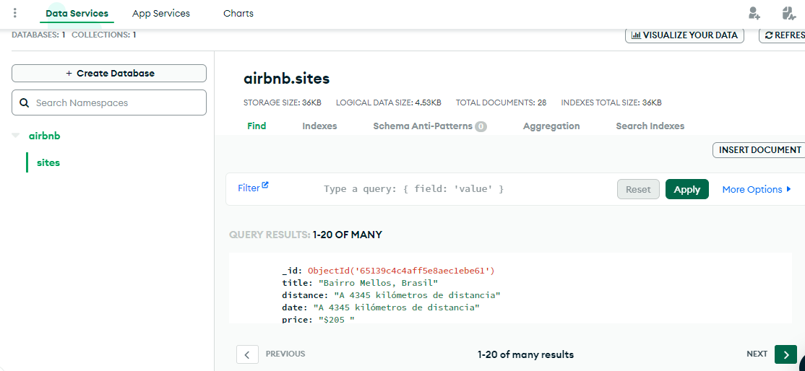

# Prueba Final Tratamiento de Datos
Prueba de tratamiento de datos.
## Web Scraping de Airbnb

Este es un proyecto de web scraping que utiliza Selenium para extraer información de alojamientos vacacionales en Airbnb. El código accede al sitio web de Airbnb, recopila datos como el título, la distancia o las fechas, el valor y las calificaciones de los alojamientos, y los almacena en una base de datos MongoDB.

    
## Requisitos

Antes de ejecutar este proyecto, asegúrate de tener instalado lo siguiente:

- Python 3.x: [Descargar Python](https://www.python.org/downloads/)

Instalar librerias
```commandline
pip install -r requirements
```
## Configuración
###  Variables
Antes de ejecutar el programa, es necesario  configurar las siguientes variables de entorno en un archivo `.env`:

```commandline

MONGO_USER=username # replace with yours
MONGO_PASSWORD=password # replace with yours
MONGO_HOST=cluster0.patata.mongodb.net # replace with yours
```
Asegúrate de reemplazar los valores de las variables con tu información personal.

## Uso

1. Ejecuta el archivo `main.py` para iniciar el proceso de web scraping de Airbnb. El código abrirá el sitio web de Airbnb, esperará a que la página se cargue y extraerá los datos de los alojamientos.
2. Los datos extraídos se almacenarán en una base de datos MongoDB utilizando la clase `MongoConnection` del archivo `mongo.py`.

Validación de almacenamiento de datos en Mongo DB



Si tienes alguna pregunta o problema, no dudes en abrir un problema (issue) en este repositorio.

## Autor

- [@econdor9](https://github.com/econdor9)

[](https://opensource.org/licenses/)

   